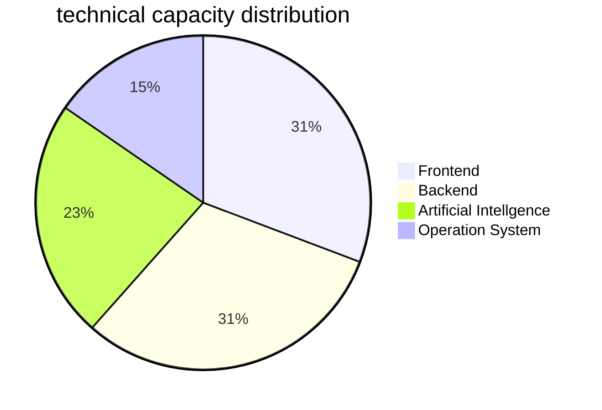

# Geekmister

**`Independent Developer · OneAI (One Person Company)`**  
*Also Psychologist*

Committed to product development and artificial intelligence, driving OneAI towards profitability with a continuous working attitude, while adhering to long-termism.

---

	

## ✨ Personal Profile

Hi，I'm **Geekmister**, nice to meet you here 😆

I am a 🧑‍💻 full-stack independent developer and also a 🧠 psychological analyst, currently diving into 🤖 AI entrepreneurship as a 🏢 one-person company 🚀. My signature project is the WeChat mini‑program 「Emotion Hut」🧩🆘, which features a variety of 🧘‍♀️ emotional first‑aid modules designed to help users ⚡ quickly stabilise their emotions during mood swings 📉→📈. This mini‑program has already surpassed 50,000 👥 total users, with a stable daily active user count of 1,000+ 📊✨. It brings me 💰 financial rewards, and at the same time, I gain ❤️ abundant spiritual fulfillment from 🤝 helping others. I love turning my 💡 ideas into reality step by step with 💻 code, so besides 「Emotion Hut」, I am continuously and incrementally developing 🛠️ various products, constantly iterating and polishing 🔁💎. On the psychological analyst side, I have served over 1,000 🫂🧑‍🤝‍🧑 clients both online and offline, accompanying them through 😰 anxiety, 💢 emotional distress, or 🔗 relationship difficulties 🌪️. Being able to truly 🫶 help others is something that makes me feel genuinely 😊 happy ✨🎯.

## 🚀 Project Focus

### 📁 [geekmister](https://github.com/geekmister/geekmister)
> This project integrates my 📂 GitHub Profile, 📝 personal blog, and 💡 inspiration Issue discussions, collectively and completely shaping my 🧑‍💻 personal IP.

### 📁 [IPlay-Compression](https://github.com/geekmister/IPlay-Compression)

> 🖼️ A pure front-end, locally-running image compression toolbox. 🔒 No image uploads, no reliance on the backend. ⚡ It turns the compression tasks of frequently used images into an easily accessible entry point for quick operation.

---

## 🧭 What am i doing?

🗓 June

 

- [ ] 🧩 Continuously iterate the "Emotional House" WeChat mini-program to polish the emotional first aid experience
- [ ] 📚 deep learning Advanced mathematics: linear algebra, Probability Theory, Calculus  

## 🧰 Technolgy Stack

  

## 🌍 language ability

  
  
  

## 📊 Technology Structure Preview

## 📈 GitHub Data Pannel

  
  

## 🤝 Collaboration Mode

💡 If you are interested in my projects, ideas, or collaboration directions, please feel free to contact me through issues 📩, emails ✉️, or social media 🌐. I am willing to communicate with each other seriously, whether it is open‑source co‑construction 🧩, product communication 🗣️, or engineering experience sharing 🛠️.

## 📬 Contact Mode

  
  
  

## 🧭 Acknowledgements & Credits

This page leverages many excellent open-source tools and community resources, and a special thanks to everyone who continuously shares inspiration:

- 🎨 **GitHub Emoji & Badges** – making expression more vivid → [Official Emoji List](https://github.com/ikatyang/emoji-cheat-sheet) · [Badges](https://github.com/badges/shields)
- 🛡️ **[Shields.io](https://shields.io/)** – making information display clearer and more consistent
- 📊 **[Mermaid](https://mermaid.js.org/)** – making structural diagrams and flowcharts more intuitive
- 📈 **[GitHub Readme Stats](https://github.com/anuraghazra/github-readme-stats)** – making public data more visually presentable

---

  <strong>By Geekmister building with love and long-termism</strong>
   
  © 2026 Geekmister · All rights reserved

