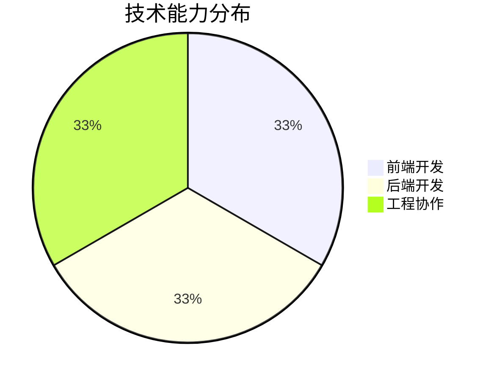

# Geekmister

**`Independent Developer · OneAI (One Person Company)`**  
*Also Psychologist*

Committed to product development and artificial intelligence, driving OneAI towards profitability with a continuous working attitude, while adhering to long-termism.

---

## ✨ Personal Profile

你好，我是 **Geekmister**。

我专注于 **全栈开发、质量工程、自动化效率建设**，长期关注从想法落地到稳定交付的完整过程。相比单纯把功能做出来，我更在意系统是否可靠、体验是否顺滑、结构是否足够长期可维护。

当前的核心关键词：

- 🔭 持续构建个人作品与开源项目矩阵
- 🧪 深耕测试体系、质量保障与工程流程优化
- ⚙️ 探索自动化工具、数据抓取与效率型产品
- 🌱 保持节奏，认真生活，也认真创造

## 🚀 项目聚焦

### 📁 [geekmister](https://github.com/你的用户名/geekmister)
> 个人主页与项目展示集合，承担品牌表达与作品沉淀

---

### 🎵 [Iplay](https://github.com/你的用户名/Iplay)
> 注重体验与交互细节的音乐播放器项目

---

### 😂 [AUmoji](https://github.com/你的用户名/AUmoji)
> 面向表达场景的表情工具集合

---

### 🤖 [AutoClient](https://github.com/你的用户名/AutoClient)
> 面向重复性工作的任务自动化工具

## 🧭 我正在做什么

- 为项目建立更稳定的质量基线与交付流程
- 打磨个人品牌主页与作品展示体系
- 设计更具复用价值的自动化工作流
- 让技术输出兼具专业度、完成度与美感

## 🧰 技术栈

  

## 🌍 语言能力

  
  
  

## 📊 技术结构一览

## 📈 GitHub 数据面板

  
  

## 🤝 协作方式

如果你对我的项目、想法或合作方向感兴趣，欢迎通过 Issue、邮件或社交平台联系我。无论是开源共建、产品交流，还是工程经验分享，我都很乐意认真沟通。

### 参与建议

1. Fork 仓库并创建你的功能分支
2. 提交清晰、可追踪的变更说明
3. 发起 Pull Request 并附上必要背景
4. 对较大改动，建议先通过 Issue 讨论

## 📬 联系方式

  
  
  
  
  

## 📚 致谢与灵感来源

这个页面借助了不少优秀工具与社区资源，也感谢所有持续分享灵感的人：

- GitHub Emoji 与徽标生态，让表达更鲜明
- Shields.io，让信息展示更清晰统一
- Mermaid，让结构信息更直观
- GitHub Stats 服务，让公开数据更具可视化表现

---

  <strong>由 Geekmister 用热爱与长期主义持续构建</strong>
   
  © 2026 Geekmister · 保留所有权利

