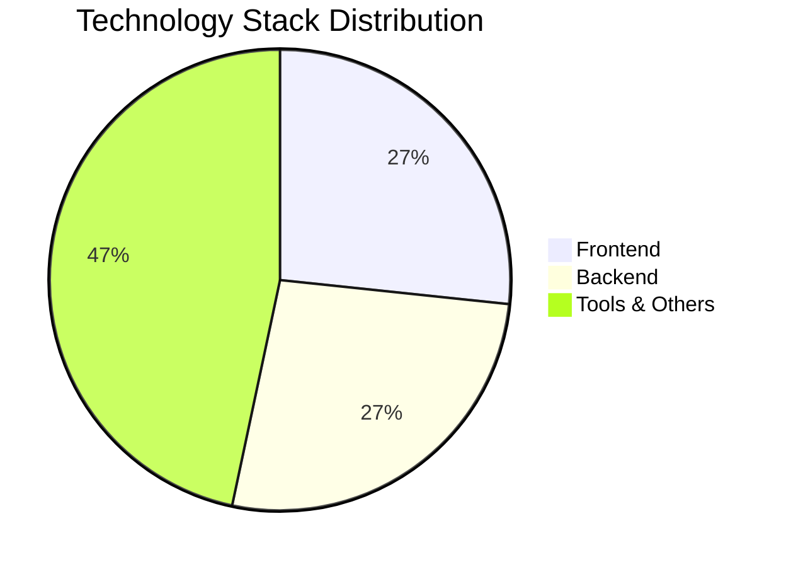
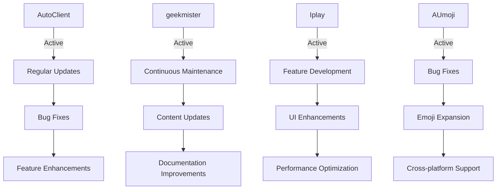

<div align="center">
  
  
  <h1>👋 Hi, I'm Geekmister! 🎉</h1>
  
  <div style="display: flex; flex-wrap: wrap; justify-content: center; gap: 10px; margin: 20px 0;">
    <a href="https://github.com/geekmister" target="_blank">
      
    </a>
    <a href="https://linkedin.com/in/geekmister" target="_blank">
      
    </a>
    <a href="https://twitter.com/MrGeekmister" target="_blank">
      
    </a>
    <a href="mailto:geekmister.mg@gmail.com">
      
    </a>
  </div>
  
  <p>Full Stack Software Engineer | Software Test Manager | Independent Developer</p>
  
  <a href="https://www.buymeacoffee.com/geekmister" target="_blank">
    
  </a>
</div>

## 📋 Table of Contents

- [🌟 About Me](#about-me)
- [🚀 Projects](#projects)
- [💻 Technology Stack](#technology-stack)
- [🌍 Languages](#languages)
- [📊 Data Visualization](#data-visualization)
- [📈 GitHub Analytics](#github-analytics)
- [💡 My Inspiration](#my-inspiration)
- [🤝 Contributing](#contributing)
- [📞 Contact](#contact)
- [📚 Resources](#resources)

## 🌟 About Me

I'm Geekmister, a passionate full-stack software engineer and software test manager with a strong interest in open source development. I love creating innovative solutions and sharing my work with the community. Here's what I'm currently up to:

- 🔧 Working as a software test manager at a company
- 📱 Developing official website v2.0 for zmlh (outsourcing project)
- 🕷️ Building a personal spider system for data crawling
- 🧠 Fighting depression and maintaining a healthy lifestyle

## 🚀 Projects

### Open Source Projects

<div style="overflow-x: auto; margin: 20px 0;">
  <table style="width: 100%; border-collapse: collapse; text-align: left;">
    <thead>
      <tr style="background-color: #f5f5f5;">
        <th style="padding: 12px; border: 1px solid #ddd;"><b>Projects 💻</b></th>
        <th style="padding: 12px; border: 1px solid #ddd;"><b>Description 📝</b></th>
        <th style="padding: 12px; border: 1px solid #ddd;"><b>Status �</b></th>
        <th style="padding: 12px; border: 1px solid #ddd;"><b>Stars 🌟</b></th>
        <th style="padding: 12px; border: 1px solid #ddd;"><b>Language 👨‍💻</b></th>
      </tr>
    </thead>
    <tbody>
      <tr>
        <td style="padding: 12px; border: 1px solid #ddd;">
          <a href="https://github.com/geekmister/AutoClient" style="text-decoration: none; font-weight: bold;">AutoClient</a>
        </td>
        <td style="padding: 12px; border: 1px solid #ddd;">Automation client tool for simplifying repetitive tasks</td>
        <td style="padding: 12px; border: 1px solid #ddd;">
          <span style="color: green; font-weight: bold;">Active</span>
        </td>
        <td style="padding: 12px; border: 1px solid #ddd;">
          
        </td>
        <td style="padding: 12px; border: 1px solid #ddd;">
          
        </td>
      </tr>
      <tr style="background-color: #f9f9f9;">
        <td style="padding: 12px; border: 1px solid #ddd;">
          <a href="https://github.com/geekmister/geekmister" style="text-decoration: none; font-weight: bold;">geekmister</a>
        </td>
        <td style="padding: 12px; border: 1px solid #ddd;">Personal homepage and project collection</td>
        <td style="padding: 12px; border: 1px solid #ddd;">
          <span style="color: green; font-weight: bold;">Active</span>
        </td>
        <td style="padding: 12px; border: 1px solid #ddd;">
          
        </td>
        <td style="padding: 12px; border: 1px solid #ddd;">
          
        </td>
      </tr>
      <tr>
        <td style="padding: 12px; border: 1px solid #ddd;">
          <a href="https://github.com/geekmister/Iplay" style="text-decoration: none; font-weight: bold;">Iplay</a>
        </td>
        <td style="padding: 12px; border: 1px solid #ddd;">Music player application</td>
        <td style="padding: 12px; border: 1px solid #ddd;">
          <span style="color: green; font-weight: bold;">Active</span>
        </td>
        <td style="padding: 12px; border: 1px solid #ddd;">
          
        </td>
        <td style="padding: 12px; border: 1px solid #ddd;">
          
        </td>
      </tr>
      <tr style="background-color: #f9f9f9;">
        <td style="padding: 12px; border: 1px solid #ddd;">
          <a href="https://github.com/geekmister/AUmoji" style="text-decoration: none; font-weight: bold;">AUmoji</a>
        </td>
        <td style="padding: 12px; border: 1px solid #ddd;">Emoji toolset</td>
        <td style="padding: 12px; border: 1px solid #ddd;">
          <span style="color: green; font-weight: bold;">Active</span>
        </td>
        <td style="padding: 12px; border: 1px solid #ddd;">
          
        </td>
        <td style="padding: 12px; border: 1px solid #ddd;">
          
        </td>
      </tr>
    </tbody>
  </table>
</div>

### Project Showcase

#### AutoClient
- **Core Features**: Task automation, scheduled execution, user-friendly interface
- **Use Case**: Automating repetitive tasks to save time and reduce errors
- **Technology**: JavaScript, Node.js

#### Iplay
- **Core Features**: Music playback, playlist management, equalizer
- **Use Case**: Enjoying music with enhanced control and customization
- **Technology**: Vue 3, JavaScript

#### AUmoji
- **Core Features**: Emoji collection, customization, export options
- **Use Case**: Adding expressive emoji to messages and content
- **Technology**: HTML, CSS, JavaScript

## 💻 Technology Stack

### Frontend Technologies
<div style="display: flex; flex-wrap: wrap; gap: 10px; margin: 10px 0;">
  
  
  
  
</div>

### Backend Technologies
<div style="display: flex; flex-wrap: wrap; gap: 10px; margin: 10px 0;">
  
  
  
  
</div>

### Tools & Others
<div style="display: flex; flex-wrap: wrap; gap: 10px; margin: 10px 0;">
  
  
  
  
  
  
  
</div>

## 🌍 Languages

| Language | Proficiency |
|----------|-------------|
| :cn: Simplified Chinese | ★★★ (Native) |
| :england: English | ★★☆ (Professional) |
| :jp: Japanese | ★☆☆ (Basic) |

## 📊 Data Visualization

### Technology Stack Distribution


### Project Activity Flow


### Skills Proficiency Radar
```mermaid
radar
    title Skills Proficiency
    width 500 height 300
    axis "JavaScript" 85
    axis "Python" 80
    axis "Vue.js" 75
    axis "Java" 70
    axis "HTML/CSS" 90
    axis "Git" 95
    axis "Node.js" 80
    data "Proficiency" 85 80 75 70 90 95 80
```

## 📈 GitHub Analytics

<div style="display: flex; flex-wrap: wrap; justify-content: center; gap: 20px; margin: 20px 0;">
  <a href="https://github.com/geekmister">
    
  </a>
  <a href="https://github.com/geekmister">
    
  </a>
</div>

## 💡 My Inspiration

### 1. Material Management
I encountered challenges with managing large volumes of images, videos, and other materials while creating Xiaohongshu notes and product details. The traditional folder-based organization was inefficient, with materials scattered across multiple devices, duplicates, and difficulty in searching. I'm developing a specialized material management tool to address these issues. While similar tools exist, they often require payment and don't fully meet my needs. Open-sourcing this project would allow it to benefit from community contributions and ideas.

### 2. Xiaohongshu Analysis
As a Xiaohongshu operator, I needed insights into account performance, competitor analysis, and account weight. I'm developing a comprehensive analysis tool for Xiaohongshu, but I plan to keep it closed-source due to potential commercialization opportunities. I'm collecting user requirements to guide development.

### 3. Personal Cloud Storage
With large amounts of photos, videos, and files across multiple devices, commercial cloud storage solutions often require paid subscriptions. I'm building a personal cloud storage service using COS (Cloud Object Storage) to provide a cost-effective alternative.

## 🤝 Contributing

I welcome contributions to my projects! Here's how you can get involved:

1. **Fork** the repository
2. **Create** a new branch (`git checkout -b feature/AmazingFeature`)
3. **Commit** your changes (`git commit -m 'Add some AmazingFeature'`)
4. **Push** to the branch (`git push origin feature/AmazingFeature`)
5. **Open** a Pull Request

Please make sure to follow the project's code style and guidelines. For major changes, please open an issue first to discuss what you would like to change.

### Code of Conduct

All contributors are expected to adhere to the project's code of conduct, which includes:
- Being respectful and inclusive
- Providing constructive feedback
- Focusing on the project's best interests
- Resolving conflicts professionally

## 📞 Contact

Feel free to reach out to me through any of the following channels:

<div style="display: flex; flex-wrap: wrap; justify-content: center; gap: 15px; margin: 20px 0;">
  <a href="https://linkedin.com/in/geekmister" target="_blank" style="text-decoration: none;">
    <div style="display: flex; align-items: center; gap: 5px; padding: 8px 15px; background-color: #0077B5; color: white; border-radius: 5px;">
      <svg xmlns="http://www.w3.org/2000/svg" width="20" height="20" fill="currentColor" viewBox="0 0 24 24">
        <path d="M4.98 3.5c0 1.381-1.11 2.5-2.48 2.5s-2.48-1.119-2.48-2.5c0-1.38 1.11-2.5 2.48-2.5s2.48 1.12 2.48 2.5zm.02 4.5h-5v16h5v-16zm7.982 0h-4.968v16h4.969v-8.399c0-4.67 6.029-5.052 6.029 0v8.399h4.988v-10.131c0-7.88-8.922-7.593-11.018-3.714v-2.155z"/>
      </svg>
      LinkedIn
    </div>
  </a>
  
  <a href="https://twitter.com/MrGeekmister" target="_blank" style="text-decoration: none;">
    <div style="display: flex; align-items: center; gap: 5px; padding: 8px 15px; background-color: #1DA1F2; color: white; border-radius: 5px;">
      <svg xmlns="http://www.w3.org/2000/svg" width="20" height="20" fill="currentColor" viewBox="0 0 24 24">
        <path d="M24 4.557c-.883.392-1.832.656-2.828.775 1.017-.609 1.798-1.574 2.165-2.724-.951.564-2.005.974-3.127 1.195-.897-.957-2.178-1.555-3.594-1.555-3.179 0-5.515 2.966-4.797 6.045-4.091-.205-7.719-2.165-10.148-5.144-1.29 2.213-.669 5.108 1.523 6.574-.806-.026-1.566-.247-2.229-.616-.054 2.281 1.581 4.415 3.949 4.89-.693.188-1.452.232-2.224.084.626 1.956 2.444 3.379 4.6 3.419-2.07 1.623-4.678 2.348-7.29 2.04 2.179 1.397 4.768 2.212 7.548 2.212 9.142 0 14.307-7.721 13.995-14.646.962-.695 1.797-1.562 2.457-2.549z"/>
      </svg>
      Twitter
    </div>
  </a>
  
  <a href="https://instagram.com/MrGeekmister" target="_blank" style="text-decoration: none;">
    <div style="display: flex; align-items: center; gap: 5px; padding: 8px 15px; background-color: #E4405F; color: white; border-radius: 5px;">
      <svg xmlns="http://www.w3.org/2000/svg" width="20" height="20" fill="currentColor" viewBox="0 0 24 24">
        <path d="M12 2.163c3.204 0 3.584.012 4.85.07 3.252.148 4.771 1.691 4.919 4.919.058 1.265.069 1.645.069 4.849 0 3.205-.012 3.584-.069 4.849-.149 3.225-1.664 4.771-4.919 4.919-1.266.058-1.644.07-4.85.07-3.204 0-3.584-.012-4.849-.07-3.26-.149-4.771-1.699-4.919-4.92-.058-1.265-.07-1.644-.07-4.849 0-3.204.013-3.583.07-4.849.149-3.227 1.664-4.771 4.919-4.919 1.266-.057 1.645-.069 4.849-.069zm0-2.163c-3.259 0-3.667.014-4.947.072-4.358.2-6.78 2.618-6.98 6.98-.059 1.281-.073 1.689-.073 4.948 0 3.259.014 3.668.072 4.948.2 4.358 2.618 6.78 6.98 6.98 1.281.058 1.689.072 4.948.072 3.259 0 3.668-.014 4.948-.072 4.354-.2 6.782-2.618 6.979-6.98.059-1.28.073-1.689.073-4.948 0-3.259-.014-3.667-.072-4.947-.196-4.354-2.617-6.78-6.979-6.98-1.281-.059-1.69-.073-4.949-.073zm0 5.838c-3.403 0-6.162 2.759-6.162 6.162s2.759 6.163 6.162 6.163 6.162-2.759 6.162-6.163c0-3.403-2.759-6.162-6.162-6.162zm0 10.162c-2.209 0-4-1.79-4-4 0-2.209 1.791-4 4-4s4 1.791 4 4c0 2.21-1.791 4-4 4zm6.406-11.845c-.796 0-1.441.645-1.441 1.44s.645 1.44 1.441 1.44c.795 0 1.439-.645 1.439-1.44s-.644-1.44-1.439-1.44z"/>
      </svg>
      Instagram
    </div>
  </a>
  
  <a href="mailto:geekmister.mg@gmail.com" style="text-decoration: none;">
    <div style="display: flex; align-items: center; gap: 5px; padding: 8px 15px; background-color: #D14836; color: white; border-radius: 5px;">
      <svg xmlns="http://www.w3.org/2000/svg" width="20" height="20" fill="currentColor" viewBox="0 0 24 24">
        <path d="M12 2.04c-5.509 0-10 4.491-10 10s4.491 10 10 10 10-4.491 10-10-4.491-10-10-10zm0 18c-4.418 0-8-3.582-8-8s3.582-8 8-8 8 3.582 8 8-3.582 8-8 8zm3.596-10.404l-6.18 4.12-6.179-4.12-.707 1.06 6.887 4.594 6.888-4.593-.707-1.061z"/>
      </svg>
      Gmail
    </div>
  </a>
</div>

## 📚 Resources

The following resources were used when creating this README, and they're incredibly helpful!

- 💟 [GitHub Emoji Picker](https://github-emoji-picker.rickstaa.dev/) - Add vibrant emojis to your content
- ⭐ [Visitor Badge](https://visitor-badge.glitch.me/) - Track visits to your profile and repositories
- 🎉 [Profile Templates](https://github.com/topics/profile-template) - Great templates for GitHub profiles
- 💰 [Buy Me a Coffee](https://www.buymeacoffee.com/) - Support creators with donations
- 🛡️ [Shields.io](https://shields.io/) - Create custom badges for your projects
- 📊 [Mermaid](https://mermaid-js.github.io/mermaid/) - Create diagrams and visualizations

---

<div align="center">
  <p>Built with ❤️ by Geekmister</p>
  <p>© 2026 Geekmister. All rights reserved.</p>
  <p></p>
</div>