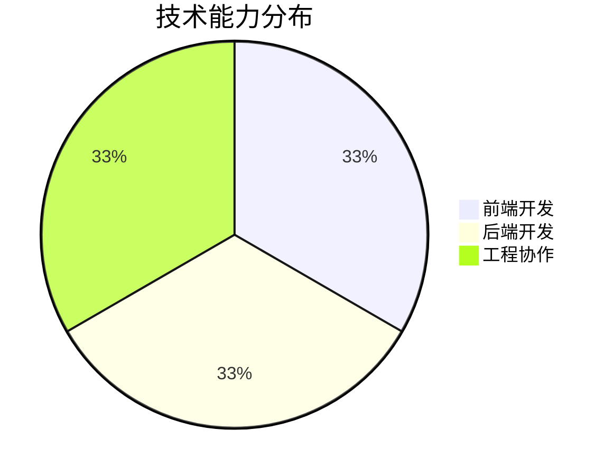

# Geekmister

**`Independent Developer · OneAI (One Person Company)`**  
*Also Psychologist*

Committed to product development and artificial intelligence, driving OneAI towards profitability with a continuous working attitude, while adhering to long-termism.

---

## ✨ Personal Profile

Hi，I'm **Geekmister**, nice to meet you here 😆

I am a 🧑‍💻 full-stack independent developer and also a 🧠 psychological analyst, currently diving into 🤖 AI entrepreneurship as a 🏢 one-person company 🚀. My signature project is the WeChat mini‑program 「Emotion Hut」🧩🆘, which features a variety of 🧘‍♀️ emotional first‑aid modules designed to help users ⚡ quickly stabilise their emotions during mood swings 📉→📈. This mini‑program has already surpassed 50,000 👥 total users, with a stable daily active user count of 1,000+ 📊✨. It brings me 💰 financial rewards, and at the same time, I gain ❤️ abundant spiritual fulfillment from 🤝 helping others. I love turning my 💡 ideas into reality step by step with 💻 code, so besides 「Emotion Hut」, I am continuously and incrementally developing 🛠️ various products, constantly iterating and polishing 🔁💎. On the psychological analyst side, I have served over 1,000 🫂🧑‍🤝‍🧑 clients both online and offline, accompanying them through 😰 anxiety, 💢 emotional distress, or 🔗 relationship difficulties 🌪️. Being able to truly 🫶 help others is something that makes me feel genuinely 😊 happy ✨🎯.

## 🚀 Project Focus

### 📁 [geekmister](https://github.com/geekmister/geekmister)
> This project integrates my 📂 GitHub Profile, 📝 personal blog, and 💡 inspiration Issue discussions, collectively and completely shaping my 🧑‍💻 personal IP.

---

## 🧭 What am i doing?

🗓 June

 

- [ ] 🧩 Continuously iterate the "Emotional House" WeChat mini-program to polish the emotional first aid experience
- [ ] 📚 deep learning Advanced mathematics: linear algebra, Probability Theory, Calculus  

## 🧰 Technolgy Stack

  

## 🌍 language ability

  
  
  

## 📊 技术结构一览

## 📈 GitHub 数据面板

  
  

## 🤝 协作方式

如果你对我的项目、想法或合作方向感兴趣，欢迎通过 Issue、邮件或社交平台联系我。无论是开源共建、产品交流，还是工程经验分享，我都很乐意认真沟通。

### 参与建议

1. Fork 仓库并创建你的功能分支
2. 提交清晰、可追踪的变更说明
3. 发起 Pull Request 并附上必要背景
4. 对较大改动，建议先通过 Issue 讨论

## 📬 联系方式

  
  
  
  
  

## 📚 致谢与灵感来源

这个页面借助了不少优秀工具与社区资源，也感谢所有持续分享灵感的人：

- GitHub Emoji 与徽标生态，让表达更鲜明
- Shields.io，让信息展示更清晰统一
- Mermaid，让结构信息更直观
- GitHub Stats 服务，让公开数据更具可视化表现

---

  <strong>由 Geekmister 用热爱与长期主义持续构建</strong>
   
  © 2026 Geekmister · 保留所有权利

