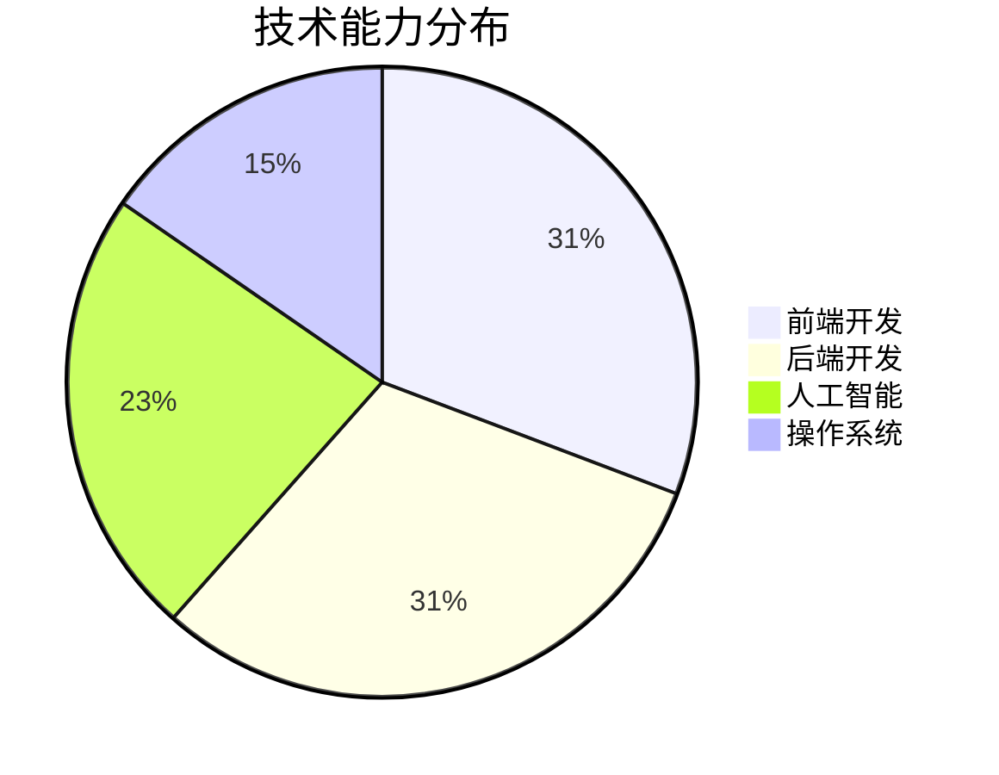

# Geekmister

**`独立开发者 · OneAI（一人公司）`**  
*同时也是心理学分析师*

致力于产品开发与人工智能领域，以持续工作的态度推动 OneAI 走向盈利，同时秉持长期主义精神。

---

## ✨ 个人简介

你好，我是 **Geekmister**，很高兴在这里认识你 😆

我是一名 🧑‍💻 全栈独立开发者，同时也是 🧠 心理学分析师，目前正在以 🏢 一人公司 🚀 的形式深耕 🤖 AI 创业领域。我的代表项目是整合了 GitHub 个人主页、个人博客与灵感讨论的综合平台。

## 🚀 项目重点

### 📁 [geekmister](https://github.com/geekmister/geekmister)
> 这个项目整合了我的 📂 GitHub 个人主页、📝 个人博客，以及 💡 灵感讨论的 Issue，共同完整地塑造了我的 🧑‍💻 个人品牌 IP。

---

## 🧭 我正在做什么

🗓 六月

 

- [ ] 🧩 持续迭代"情感小屋"微信小程序，打磨情感急救体验
- [ ] 📚 深度学习高等数学：线性代数、概率论、微积分

## 🧰 技术栈

  

## 🌍 语言能力

  
  
  

## 📊 技术能力分布

## 📈 GitHub 数据面板

  
  

## 🤝 协作方式

💡 如果你对我的项目、想法或合作方向感兴趣，欢迎通过 Issue 📩、邮件 ✉️ 或社交媒体 🌐 联系我。无论是开源共建、产品交流，还是工程经验分享，我都很乐意沟通交流。

## 📬 联系方式

  
  
  

## 🧭 致谢与灵感来源

这个页面能够呈现出目前的样貌，离不开社区中许多优秀的开源工具和资源的支持。特此感谢所有持续分享灵感的人们：

- 🎨 **GitHub Emoji 与徽标** – 让表达更加生动 → [官方 Emoji 列表](https://github.com/ikatyang/emoji-cheat-sheet) · [徽标](https://github.com/badges/shields)
- 🛡️ **[Shields.io](https://shields.io/)** – 让信息展示更加清晰统一
- 📊 **[Mermaid](https://mermaid.js.org/)** – 让结构图表和流程图更加直观
- 📈 **[GitHub Readme Stats](https://github.com/anuraghazra/github-readme-stats)** – 让公开数据具有更好的可视化表现

---

  <strong>由 Geekmister 用热爱与长期主义精神持续构建 ❤️</strong>
   
  © 2026 Geekmister · 保留所有权利

