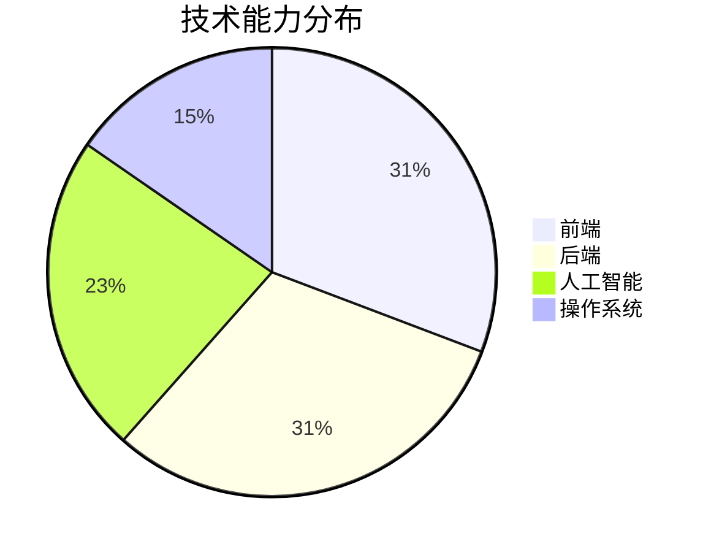

# Geekmister

**独立开发者 · OneAI（一人公司）**  
*亦为心理分析师*

致力于产品开发与人工智能，以持续工作的态度推动 OneAI 实现盈利，并坚守长期主义。

---

	

## ✨ 个人简介

你好，我是 **Geekmister**，很高兴在这里见到你 😆

我是一名 🧑‍💻 全栈独立开发者，同时也是一名 🧠 心理分析师，目前正以 🏢 一人公司的形式投身于 🤖 AI 创业 🚀。我的代表作是微信小程序「**情绪屋屋**」🧩🆘，它内置了多种 🧘‍♀️ 情绪急救模块，帮助用户在情绪波动时 ⚡ 快速稳定自己的情绪 📉→📈。这款小程序已累计获得超过 5 万 👥 用户，日活跃用户稳定在 1000+ 📊✨。它为我带来了 💰 经济收益，同时也让我从 🤝 帮助他人中收获了 ❤️ 丰盈的精神回报。我喜欢将自己的 💡 创意一步步用 💻 代码实现，因此除了「情绪屋屋」，我还在持续渐进地开发 🛠️ 各类产品，不断迭代与打磨 🔁💎。在心理分析师的身份下，我已线上线下服务了超过 1000 位 🫂🧑‍🤝‍🧑 来访者，陪伴他们面对 😰 焦虑、💢 情绪困扰或 🔗 关系难题 🌪️。能够真正 🫶 帮助到他人，是让我发自内心感到 😊 开心的事 ✨🎯。

## 🚀 项目聚焦

### 📁 [geekmister](https://github.com/geekmister/geekmister)
> 这个项目整合了我的 📂 GitHub Profile、📝 个人博客以及 💡 灵感 Issue 讨论，共同完整地塑造了我的 🧑‍💻 个人 IP。

### 📁 [IPlay-Compression](https://github.com/geekmister/IPlay-Compression)

> 🖼️ 一个纯前端、本地运行的图像压缩工具包。 🔒 不需要上传图像，也不依赖后端。 ⚡ 它将常用图像的压缩任务转化为一个易于访问的入口，以便快速操作。

---

## 🧭 我正在做什么？

🗓 六月计划

 

- [ ] 🧩 持续迭代「情绪屋屋」微信小程序，打磨情绪急救体验
- [ ] 📚 深度学习高等数学：线性代数 · 概率论 · 微积分

## 🧰 技术栈

  

## 🌍 语言能力

  
  
  

## 📊 技术结构预览

## 📈 GitHub 数据面板

  
  

## 🤝 协作模式

💡 如果你对我的项目、想法或合作方向感兴趣，欢迎通过 Issues 📩、邮件 ✉️ 或社交媒体 🌐 联系我。无论是开源共建 🧩、产品交流 🗣️，还是工程经验分享 🛠️，我都愿意认真沟通。

## 📬 联系方式

  
  
  

## 🧭 致谢与致敬

本页面借助了许多优秀的开源工具和社区资源，特别感谢每一位持续分享灵感的创造者：

- 🎨 **GitHub Emoji 与徽章生态** – 让表达更鲜明 → [官方 Emoji 列表](https://github.com/ikatyang/emoji-cheat-sheet) · [徽章](https://github.com/badges/shields)
- 🛡️ **[Shields.io](https://shields.io/)** – 让信息展示更清晰统一
- 📊 **[Mermaid](https://mermaid.js.org/)** – 让结构图表更直观
- 📈 **[GitHub Readme Stats](https://github.com/anuraghazra/github-readme-stats)** – 让公开数据更具可视化表现

---

  <strong>由 Geekmister 以爱和长期主义构建</strong>
   
  © 2026 Geekmister · 保留所有权利

