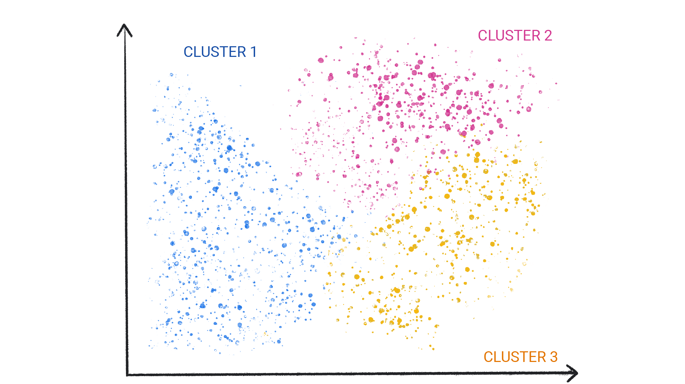
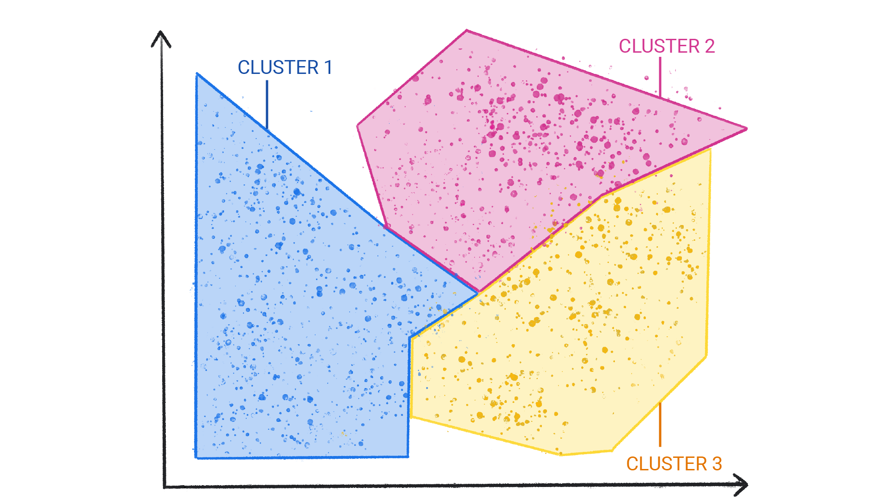
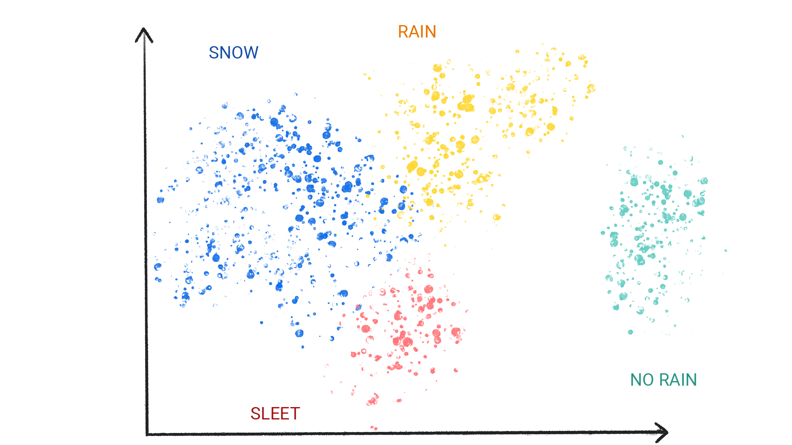
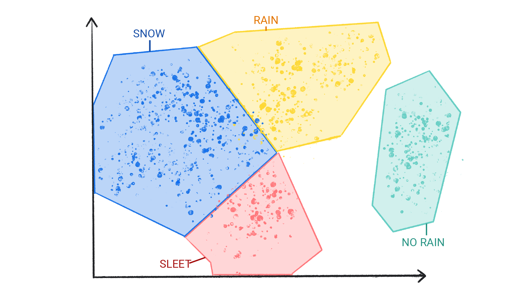

# 机器学习简介

欢迎学习“机器学习简介”。本课程将介绍机器学习 (ML) 概念。本课程不涉及如何实现机器学习或处理数据。

::: tip 
⏳ **课程预计时长：** 20 分钟 
:::

::: info

- 🎓 学习目标：
  - 了解不同类型的机器学习
  - 掌握监督式机器学习的关键概念
  - 理解如何使用机器学习解决问题，以及它与传统方法的区别 
:::

# 什么是机器学习？

从翻译应用到自动驾驶汽车，我们使用的一些最重要的技术都由机器学习 (ML) 提供支持。本课程将介绍机器学习背后的核心概念。

机器学习提供了一种解决问题、回答复杂问题和创建新内容的新方式。机器学习可以预测天气、估计出行时间、推荐歌曲、自动补全句子、总结文章，以及生成前所未见的图片。

简单来说，机器学习是指训练一段称为模型的软件，使其能够根据数据做出有用的预测或生成内容（例如文本、图片、音频或视频）。

例如，假设我们想要创建一个用于预测降雨量的应用。我们可以使用传统方法或机器学习方法。如果采用传统方法，我们需要创建地球大气层和地表的基于物理学的表示形式，并计算大量的流体动力学方程。这非常困难。

如果使用机器学习方法，我们会向机器学习模型提供大量天气数据，直到该模型最终学习到产生不同降雨量的天气模式之间的数学关系。然后，我们会向模型提供当前天气数据，让它预测降雨量。

<iframe width="100%" height="360" style="margin-bottom: 40px" src="https://www.youtube.com/embed/RdC7KZ6OFPA" title="What is ML?" frameborder="0" allow="accelerome0ter; autoplay; clipboard-write; encrypted-media; gyroscope; picture-in-picture; web-share" referrerpolicy="strict-origin-when-cross-origin" allowfullscreen></iframe>

<QuizQuestion
  prompt="在机器学习中，“模型”是什么？"
  :options="[
    { label: '模型是您研究对象的较小表示形式。', description: '' },
    { label: '模型是一种计算机硬件', description: '' },
    { label: '模型是一种从数据中推导出的数学关系，机器学习系统使用这种关系来进行预测', description: '' }
  ]"
  :correct-index="2"
/>

# 机器学习系统类型

根据机器学习系统学习进行预测或生成内容的方式，可将其归入以下一个或多个类别：

- 监督式学习
- 非监督式学习
- 强化学习
- 生成式 AI

## 监督式学习

监督学习模型在看到大量包含正确答案的数据后，可以发现数据中产生正确答案的元素之间的关联，从而做出预测。这就像学生通过学习包含问题和答案的旧考试来学习新知识。当学生通过足够多的旧考试进行训练后，便能充分做好准备来参加新考试。 这些机器学习系统是“监督式”的，因为人类会向机器学习系统提供已知正确结果的数据。

监督式学习最常见的两个应用场景是回归和分类。

### 回归

回归模型可预测数值。例如，预测降雨量（以英寸或毫米为单位）的天气模型就是一种回归模型。

如需查看更多回归模型示例，请参阅下表：

| 场景 | 可能的输入数据 | 数值预测 |
| --- | --- | --- |
| 未来房价 | 房屋面积、邮政编码、卧室和浴室数量、地块面积、抵押贷款利率、房产税率、建造成本以及该区域的待售房屋数量。 | 住宅的价格。 |
| 未来行程时间 | 历史路况信息（从智能手机、交通传感器、网约车和其他导航应用收集）、与目的地的距离以及天气状况。 | 到达目的地所需的时间（以分钟和秒为单位）。 |

### 分类

分类模型可预测某事物属于某个类别的可能性。与输出为数值的回归模型不同，分类模型输出的值用于指明某事物是否属于特定类别。例如，分类模型用于预测电子邮件是否为垃圾邮件，或照片中是否包含猫。

分类模型分为两组：二元分类和多类别分类。二元分类模型会输出仅包含两个值的类中的一个值，例如，输出 rain 或 no rain 的模型。多类别分类模型会输出一个值，该值来自包含两个以上值的类别，例如，可以输出 rain、hail、snow 或 sleet 的模型。

<iframe width="100%" height="360" style="margin-bottom: 40px" src="https://www.youtube.com/embed/NNue6rkDrws" title="Supervised Machine Learning" frameborder="0" allow="accelerometer; autoplay; clipboard-write; encrypted-media; gyroscope; picture-in-picture; web-share" referrerpolicy="strict-origin-when-cross-origin" allowfullscreen></iframe>

<QuizQuestion
  prompt="如果您想使用机器学习模型来预测商业建筑的能耗，您会使用哪种类型的模型？"
  :options="[
    { label: '回归', description: '能耗以千瓦时 (kWh) 为单位，是一个数值，因此您需要使用回归模型。' },
    { label: '分类', description: '分类模型可预测某事物是否属于某个类别，而回归模型可预测数值。由于能耗以千瓦时 (kWh) 为单位进行衡量，是一个数值，因此您需要使用回归模型。' }
  ]"
  :correct-index="0"
/>

## 非监督式学习

非监督式学习模型旨在识别数据集中的有意义模式。例如，许多非监督式学习模型都依赖于一种称为聚类的技术，将类似的数据整理成组（“聚类”）。





聚类与分类的不同之处在于，聚类中的类别不是由您定义的。例如，非监督式模型可能会根据温度对天气数据集进行聚类，从而揭示定义季节的细分。然后，您可能会尝试根据对数据集的了解来命名这些聚类。





<QuizQuestion
  prompt="监督式方法与非监督式方法的区别是什么？"
  :options="[
    { label: '监督式方法会获得包含正确答案的数据。', description: '监督式方法会获得包含正确答案的数据。 模型的工作是找到数据中能够得出正确答案的关联。 非监督式方法会获得没有正确答案的数据。其任务是在数据中查找分组。' },
    { label: '非监督式方法知道如何为数据聚类添加标签。', description: '非监督式方法不知道数据聚类的含义。 您可以根据自己对数据的理解来定义这些变量。' },
    { label: '监督式方法通常使用聚类。', description: '非监督式方法使用聚类。' },
  ]"
  :correct-index="0"
/>

## 强化学习

强化学习模型通过根据在环境中执行的操作获得奖励或惩罚来进行预测。强化学习系统会生成一项政策，用于定义获得最多奖励的最佳策略。

强化学习用于训练机器人执行任务，例如在房间内走动，以及训练软件程序（例如 AlphaGo）玩围棋。

## 生成式 AI

生成式 AI 是一类可根据用户输入生成内容的模型。例如，生成式 AI 可以创作独特的图片、音乐作品和笑话；还可以总结文章、说明如何执行任务或编辑照片。

生成式 AI 可以接受各种输入，并生成各种输出，例如文本、图片、音频和视频。它还可以采用这些元素的组合。例如，模型可以接受图片作为输入，并生成图片和文本作为输出；也可以接受图片和文本作为输入，并生成视频作为输出。

我们可以根据生成式模型的输入和输出来讨论它们，通常写为“输入类型”-“输出类型”。例如，以下是生成式模型的部分输入和输出列表：

- 文本到文本
- 文本到图像
- 文本到视频
- 文生代码
- 文字转语音
- 图片和文生图

下表展示了生成式模型的常见类型、输入示例，以及更易于阅读的输出示例：

| 类型 | 输入示例 | 输出示例 |
| --- | --- | --- |
| 文本到文本 | 勒芒耐力赛是谁创办的？ | 勒芒 24 小时耐力赛由 Automobile Club de l'Ouest (ACO) 创办。 |
| 文本到图像 | 一只外星章鱼一边看报纸一边漂浮着穿过传送门。 |  |
| 文本到视频 | 一只逼真的泰迪熊正在旧金山的海里游泳。 |  |
| 文生代码 | 编写一个 Python 循环，用于遍历数字列表并输出质数。 | ```python for number in numbers: # Check if the number is prime. is_prime = True for i in range(2, number): if number % i == 0: is_prime = False break if is_prime: print(number)``` |
| 图片转文字 |  | 这是火烈鸟。它们分布在加勒比地区。 |

生成式 AI 如何运作？从宏观层面来看，生成模型会学习数据中的模式，以生成新的但类似的数据。生成式模型如下所示：

- 通过观察他人的行为和说话风格来学习模仿他人的喜剧演员
- 通过研究大量特定风格的画作来学习以该风格绘画的艺术家
- 通过聆听特定音乐团体的众多音乐来学习如何模仿该团体声音的翻唱乐队

为了生成独特而富有创意的输出，生成式模型最初采用非监督式方法进行训练，即模型学习模仿其训练所用的数据。有时，模型会使用与模型可能需要执行的任务（例如总结文章或编辑照片）相关的特定数据，通过监督式学习或强化学习进一步训练。

生成式 AI 是一项快速发展的技术，人们不断发现新的应用场景。例如，生成式模型可自动移除分散注意力的背景或提高低分辨率图片的质量，从而帮助企业优化其电子商务商品图片。